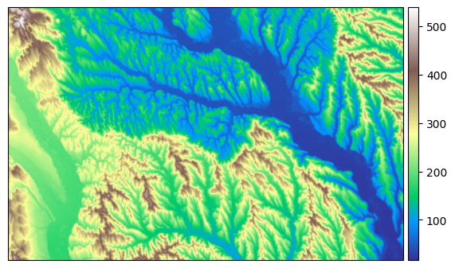
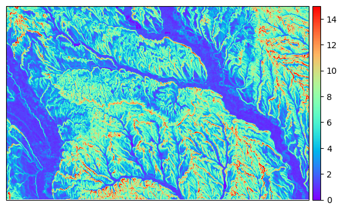
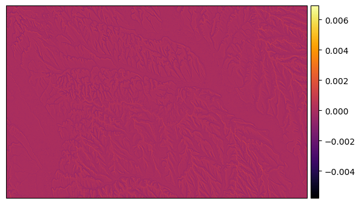

# PySAGA-cmd
PySAGA-cmd allows the usage of SAGA GIS tools in a Python environment.

## Table of Contents
- [How to download the package](#how-to-download)
- [How to use the package](#how-to-use-the-package)
  - [Choosing a SAGA GIS tool](#choosing-a-saga-gis-tool)
  - [Using flags](#using-flags)
  - [Running a SAGA GIS tool and plotting the results](#running-a-saga-gis-tool-and-plotting-the-results)

## How to download

Binary installers for the latest released version are available at the [Python Package Index (PyPI)](https://pypi.org/project/PySAGA-cmd/).
```sh
pip install PySAGA-cmd
```

## How to use the package
For information on how to use the package, check the docstrings or look at the notebook examples.

### Choosing a SAGA GIS tool
```python
from PySAGA_cmd import (
    SAGA,
    Library,
    Tool
)
```


```python
# Defining saga_cmd location
saga_cmd = '/usr/local/bin/saga_cmd'

# Instantiating a SAGA environment
saga_env = SAGA(saga_cmd=saga_cmd)
print(saga_env.run_command().text)
```

    ____________________________
    
       #####   ##   #####    ##
      ###     ###  ##       ###
       ###   # ## ##  #### # ##
        ### ##### ##    # #####
     ##### #   ##  ##### #   ##
    ____________________________
    
    SAGA Version: 9.3.0
    
    
    88 loaded tool libraries (765 tools):
     - climate_tools
     - contrib_perego
     - db_odbc
     - db_pgsql
     - dev_tools
     - docs_html
     - garden_fractals
     - garden_webservices
     - grid_analysis
     - grid_calculus
     - grid_calculus_bsl
     - grid_filter
     - grid_gridding
     - grid_spline
     - grid_tools
     - grid_visualisation
     - grids_tools
     - imagery_classification
     - imagery_isocluster
     - imagery_maxent
     - imagery_photogrammetry
     - imagery_segmentation
     - imagery_svm
     - imagery_tools
     - io_esri_e00
     - io_gdal
     - io_gps
     - io_grid
     - io_grid_image
     - io_pdal
     - io_shapes
     - io_table
     - io_virtual
     - io_webservices
     - pj_georeference
     - pj_geotrans
     - pj_proj4
     - pointcloud_tools
     - shapes_grid
     - shapes_lines
     - shapes_points
     - shapes_polygons
     - shapes_tools
     - shapes_transect
     - sim_air_flow
     - sim_cellular_automata
     - sim_ecosystems_hugget
     - sim_erosion
     - sim_fire_spreading
     - sim_geomorphology
     - sim_hydrology
     - sim_ihacres
     - sim_landscape_evolution
     - sim_qm_of_esp
     - sim_rivflow
     - statistics_grid
     - statistics_kriging
     - statistics_points
     - statistics_regression
     - ta_channels
     - ta_cliffmetrics
     - ta_compound
     - ta_hydrology
     - ta_lighting
     - ta_morphometry
     - ta_preprocessor
     - ta_profiles
     - ta_slope_stability
     - table_calculus
     - table_tools
     - tin_tools
     - vis_3d_viewer
     - _tool_chains_uncategorized *
     - climate_tools *
     - grid_filter *
     - grid_tools *
     - grids_tools *
     - imagery_classification *
     - imagery_segmentation *
     - io_table *
     - shapes_grid *
     - shapes_points *
     - shapes_polygons *
     - shapes_tools *
     - statistics_grid *
     - ta_hydrology *
     - ta_morphometry *
     - tta_tools *
    
    
    *) tool chain libraries
    
    
    
    type -h or --help for further information
    
    


```python
# Choosing a library
saga_library = saga_env.get_library(library_name='ta_morphometry')
print(saga_library.run_command().text)
```

    ____________________________
    
       #####   ##   #####    ##
      ###     ###  ##       ###
       ###   # ## ##  #### # ##
        ### ##### ##    # #####
     ##### #   ##  ##### #   ##
    ____________________________
    
    SAGA Version: 9.3.0
    
    
    Library    : Morphometry
    Category   : Terrain Analysis
    File       : /usr/local/lib/saga/libta_morphometry.so
    Description: Tools for (grid based) digital terrain analysis.
    
    Tools:
     [0]	Slope, Aspect, Curvature
     [1]	Convergence Index
     [2]	Convergence Index (Search Radius)
     [3]	Surface Specific Points
     [4]	Curvature Classification
     [5]	Hypsometry
     [6]	Real Surface Area
     [7]	Morphometric Protection Index
     [8]	Multiresolution Index of Valley Bottom Flatness (MRVBF)
     [9]	Downslope Distance Gradient
     [10]	Mass Balance Index
     [11]	Effective Air Flow Heights
     [12]	Diurnal Anisotropic Heat
     [13]	Land Surface Temperature (Lapse Rates)
     [14]	Relative Heights and Slope Positions
     [15]	Wind Effect (Windward / Leeward Index)
     [16]	Terrain Ruggedness Index (TRI)
     [17]	Vector Ruggedness Measure (VRM)
     [18]	Topographic Position Index (TPI)
     [19]	TPI Based Landform Classification
     [20]	Terrain Surface Texture
     [21]	Terrain Surface Convexity
     [22]	Terrain Surface Classification (Iwahashi and Pike)
     [23]	Morphometric Features
     [24]	Valley and Ridge Detection (Top Hat Approach)
     [25]	Fuzzy Landform Element Classification
     [26]	Upslope and Downslope Curvature
     [27]	Wind Exposition Index
     [28]	Multi-Scale Topographic Position Index (TPI)
     [29]	Wind Shelter Index
    
    
    Tool Chains: Geomorphometry
    Description: Tools for morphometric terrain analysis.
    
    Tools:
     [clustering]	Terrain Clustering
     [summits]	Summit Extraction
     [segmentation]	Terrain Segmentation
    
    
    
    type -h or --help for further information
    
    


```python
# Choosing a tool
saga_tool = saga_library.get_tool(tool_name='12')
print(saga_tool.run_command().text)
```

    Tool(saga_cmd='/usr/local/bin/saga_cmd', command=['/usr/local/bin/saga_cmd', 'ta_morphometry', '12'], _flag=None, saga=SAGA(saga_cmd='/usr/local/bin/saga_cmd', command=['/usr/local/bin/saga_cmd'], _flag=None), library_name='ta_morphometry', tool_name='12')
    ____________________________
    
       #####   ##   #####    ##
      ###     ###  ##       ###
       ###   # ## ##  #### # ##
        ### ##### ##    # #####
     ##### #   ##  ##### #   ##
    ____________________________
    
    SAGA Version: 9.3.0
    
    ____________________________
    library path: /usr/local/lib/saga/
    library path: /usr/local/lib/saga/
    library name: libta_morphometry
    library     : ta_morphometry
    tool        : Diurnal Anisotropic Heat
    identifier  : 12
    author      : J.Boehner, O.Conrad (c) 2008
    processors  : 4 [4]
    ____________________________
    
    
    Usage: saga_cmd ta_morphometry 12 [-DEM <str>] [-DAH <str>] [-ALPHA_MAX <double>]
      -DEM:<str>         	Elevation
    	grid, input
      -DAH:<str>         	Diurnal Anisotropic Heating
    	grid, output
      -ALPHA_MAX:<double>	Alpha Max (Degree)
    	floating point number
    	Minimum: 0.000000
    	Maximum: 360.000000
    	Default: 202.500000

### Using flags
```python
from PySAGA_cmd import (
    SAGA,
    Library,
    Tool
)
```


```python
# Defining saga_cmd location
saga_cmd = '/usr/local/bin/saga_cmd'

# Instantiating a SAGA environment
saga_env = SAGA(saga_cmd=saga_cmd)

# Choosing a library
saga_library = saga_env.get_library(library_name='ta_morphometry')

# Choosing a tool
saga_tool = saga_library.get_tool(tool_name='0')
```


```python
# This attribute stores the command that will be ran
saga_tool.command
```


    ['/usr/local/bin/saga_cmd', 'ta_morphometry', '0']


```python
# To add a flag, either use the 'set_flag' method or use the setter
saga_tool.set_flag('help')
print(saga_tool.command)
saga_tool.flag = 'help'
print(saga_tool.command)
```

    ['/usr/local/bin/saga_cmd', '--help', 'ta_morphometry', '0']
    ['/usr/local/bin/saga_cmd', '--help', 'ta_morphometry', '0']


```python
# To remove the flag, either set the flag attribute to None or use the 'remove_flag' method

saga_tool.set_flag('help')
saga_tool.remove_flag()
print(saga_tool.command)

saga_tool.set_flag('help')
saga_tool.flag = None
print(saga_tool.command)
```

    ['/usr/local/bin/saga_cmd', 'ta_morphometry', '0']
    ['/usr/local/bin/saga_cmd', 'ta_morphometry', '0']


```python
# To run the command, simply use the run_command() method which will return an Output object. The text attribute stores the output text of the command.
saga_tool.set_flag('help')
output = saga_tool.run_command()
print(output.text)
```

    ____________________________
    
       #####   ##   #####    ##
      ###     ###  ##       ###
       ###   # ## ##  #### # ##
        ### ##### ##    # #####
     ##### #   ##  ##### #   ##
    ____________________________
    
    SAGA Version: 9.3.0
    
    ____________________________
    library path: /usr/local/lib/saga/
    library path: /usr/local/lib/saga/
    library name: libta_morphometry
    library     : ta_morphometry
    tool        : Slope, Aspect, Curvature
    identifier  : 0
    author      : O.Conrad (c) 2001
    processors  : 4 [4]
    ____________________________
    
    Name:	Slope, Aspect, Curvature
    ID:	0
    Author:	O.Conrad (c) 2001
    Version:	1.0
    Specification:	grid
    
    ____________________________
    Description:
    Calculates the local morphometric terrain parameters slope, aspect and if supported by the chosen method also the curvature. Besides tangential curvature also its horizontal and vertical components (i.e. plan and profile curvature) can be calculated.
    ____________________________
    
    References:
     - Bauer, J., Rohdenburg, H., Bork, H.-R. (1985): Ein Digitales Reliefmodell als Vorraussetzung fuer ein deterministisches Modell der Wasser- und Stoff-Fluesse. In: Bork, H.-R., Rohdenburg, H. [Eds.]: Parameteraufbereitung fuer deterministische Gebietswassermodelle, Grundlagenarbeiten zur Analyse von Agrar-Oekosystemen, Landschaftsgenese und Landschaftsoekologie, H.10, p.1-15.
     - Beasley, D.B., Huggins, L.F. (1982): ANSWERS: User's manual. U.S. EPA-905/9-82-001, Chicago, IL. 54pp.
     - Costa-Cabral, M., Burges, S.J. (1994): Digital Elevation Model Networks (DEMON): a model of flow over hillslopes for computation of contributing and dispersal areas. Water Resources Research, v. 30, no. 6, p.1681-1692. https://doi.org/10.1029/93WR03512 (doi:10.1029/93WR03512).
     - Evans, I.S. (1979): An integrated system of terrain analysis and slope mapping. Final report on grant DA-ERO-591-73-G0040, University of Durham, England.
     - Florinsky, I.V. (2009): Computation of the third?order partial derivatives from a digital elevation model. International Journal of Geographical Information Science, 23(2), p.213-231. https://doi.org/10.1080/13658810802527499 (doi:10.1080/13658810802527499).
     - Haralick, R.M. (1983): Ridge and valley detection on digital images. Computer Vision, Graphics and Image Processing, Vol.22, No.1, p.28-38.https://doi.org/10.1016/0734-189X(83)90094-4 doi:10.1016/0734-189X(83)90094-4 (doi:10.1016/0734-189X(83)90094-4).
     - Heerdegen, R.G., Beran, M.A. (1982): Quantifying source areas through land surface curvature. Journal of Hydrology, Vol.57. https://doi.org/10.1016/0022-1694(82)90155-X (doi:10.1016/0022-1694(82)90155-X).
     - Horn, B. K. (1981): Hill shading and the relectance map. Proceedings of the IEEE, v. 69, no. 1, p.14-47. https://doi.org/10.1109/PROC.1981.11918 (doi:10.1109/PROC.1981.11918).
     - Olaya, V. (2006): Basic Land-Surface Parameters. In: Hengl, T., Reuter, H.I. [Eds.]: Geomorphometry: Concepts, Software, Applications. Developments in Soil Science, Elsevier, Vol.33, 141-169. https://doi.org/10.1016/S0166-2481(08)00006-8 (doi:10.1016/S0166-2481(08)00006-8).
     - Tarboton, D.G. (1997): A new method for the determination of flow directions and upslope areas in grid digital elevation models. Water Resources Research, Vol.33, No.2, p.309-319.
     - Travis, M.R., Elsner, G.H., Iverson, W.D., Johnson, C.G. (1975): VIEWIT: computation of seen areas, slope, and aspect for land-use planning. USDA F.S. Gen. Tech. Rep. PSW-11/1975, 70p. Berkeley, California, U.S.A.
     - Zevenbergen, L.W., Thorne, C.R. (1987): Quantitative analysis of land surface topography. Earth Surface Processes and Landforms, 12: 47-56. https://doi.org/10.1002/esp.3290120107 (doi:10.1002/esp.3290120107).
    
    ____________________________
    Input:
    _
    Elevation
    ELEVATION
    grid, input
    
    
    ____________________________
    Output:
    _
    Slope
    SLOPE
    grid, output
    
    
    _
    Aspect
    ASPECT
    grid, output
    
    
    _
    General Curvature
    C_GENE
    grid, output, optional
    
    
    _
    Profile Curvature
    C_PROF
    grid, output, optional
    
    
    _
    Plan Curvature
    C_PLAN
    grid, output, optional
    
    
    _
    Tangential Curvature
    C_TANG
    grid, output, optional
    
    
    _
    Longitudinal Curvature
    C_LONG
    grid, output, optional
    Zevenbergen & Thorne (1987) refer to this as profile curvature
    
    _
    Cross-Sectional Curvature
    C_CROS
    grid, output, optional
    Zevenbergen & Thorne (1987) refer to this as plan curvature
    
    _
    Minimal Curvature
    C_MINI
    grid, output, optional
    
    
    _
    Maximal Curvature
    C_MAXI
    grid, output, optional
    
    
    _
    Total Curvature
    C_TOTA
    grid, output, optional
    
    
    _
    Flow Line Curvature
    C_ROTO
    grid, output, optional
    
    
    ____________________________
    Options:
    _
    Method
    METHOD
    choice
    
    Available Choices:
    [0] maximum slope (Travis et al. 1975)
    [1] maximum triangle slope (Tarboton 1997)
    [2] least squares fitted plane (Horn 1981, Costa-Cabral & Burgess 1996)
    [3] 6 parameter 2nd order polynom (Evans 1979)
    [4] 6 parameter 2nd order polynom (Heerdegen & Beran 1982)
    [5] 6 parameter 2nd order polynom (Bauer, Rohdenburg, Bork 1985)
    [6] 9 parameter 2nd order polynom (Zevenbergen & Thorne 1987)
    [7] 10 parameter 3rd order polynom (Haralick 1983)
    [8] 10 parameter 3rd order polynom (Florinsky 2009)
    Default: 6
    _
    Unit
    UNIT_SLOPE
    choice
    
    Available Choices:
    [0] radians
    [1] degree
    [2] percent rise
    Default: 0
    _
    Unit
    UNIT_ASPECT
    choice
    
    Available Choices:
    [0] radians
    [1] degree
    Default: 0
    

### Running a SAGA GIS tool and plotting the results


```python
from PySAGA_cmd import (
    SAGA,
    Library,
    Tool
)
```


```python
# Defining saga_cmd location
saga_cmd = '/usr/local/bin/saga_cmd'

# Instantiating a SAGA environment
saga_env = SAGA(saga_cmd=saga_cmd)

# Choosing a library
saga_library = saga_env.get_library(library_name='ta_morphometry')

# Choosing a tool
saga_tool = saga_library.get_tool(tool_name='0')

# Use this line of code to see which parameters you have to set
print(saga_tool.run_command().text)
```

    ____________________________
    
       #####   ##   #####    ##
      ###     ###  ##       ###
       ###   # ## ##  #### # ##
        ### ##### ##    # #####
     ##### #   ##  ##### #   ##
    ____________________________
    
    SAGA Version: 9.3.0
    
    ____________________________
    library path: /usr/local/lib/saga/
    library path: /usr/local/lib/saga/
    library name: libta_morphometry
    library     : ta_morphometry
    tool        : Slope, Aspect, Curvature
    identifier  : 0
    author      : O.Conrad (c) 2001
    processors  : 4 [4]
    ____________________________
    
    
    Usage: saga_cmd ta_morphometry 0 [-ELEVATION <str>] [-SLOPE <str>] [-ASPECT <str>] [-C_GENE <str>] [-C_PROF <str>] [-C_PLAN <str>] [-C_TANG <str>] [-C_LONG <str>] [-C_CROS <str>] [-C_MINI <str>] [-C_MAXI <str>] [-C_TOTA <str>] [-C_ROTO <str>] [-METHOD <str>] [-UNIT_SLOPE <str>] [-UNIT_ASPECT <str>]
      -ELEVATION:<str>  	Elevation
    	grid, input
      -SLOPE:<str>      	Slope
    	grid, output
      -ASPECT:<str>     	Aspect
    	grid, output
      -C_GENE:<str>     	General Curvature
    	grid, output, optional
      -C_PROF:<str>     	Profile Curvature
    	grid, output, optional
      -C_PLAN:<str>     	Plan Curvature
    	grid, output, optional
      -C_TANG:<str>     	Tangential Curvature
    	grid, output, optional
      -C_LONG:<str>     	Longitudinal Curvature
    	grid, output, optional
      -C_CROS:<str>     	Cross-Sectional Curvature
    	grid, output, optional
      -C_MINI:<str>     	Minimal Curvature
    	grid, output, optional
      -C_MAXI:<str>     	Maximal Curvature
    	grid, output, optional
      -C_TOTA:<str>     	Total Curvature
    	grid, output, optional
      -C_ROTO:<str>     	Flow Line Curvature
    	grid, output, optional
      -METHOD:<str>     	Method
    	choice
    	Available Choices:
    	[0] maximum slope (Travis et al. 1975)
    	[1] maximum triangle slope (Tarboton 1997)
    	[2] least squares fitted plane (Horn 1981, Costa-Cabral & Burgess 1996)
    	[3] 6 parameter 2nd order polynom (Evans 1979)
    	[4] 6 parameter 2nd order polynom (Heerdegen & Beran 1982)
    	[5] 6 parameter 2nd order polynom (Bauer, Rohdenburg, Bork 1985)
    	[6] 9 parameter 2nd order polynom (Zevenbergen & Thorne 1987)
    	[7] 10 parameter 3rd order polynom (Haralick 1983)
    	[8] 10 parameter 3rd order polynom (Florinsky 2009)
    	Default: 6
      -UNIT_SLOPE:<str> 	Unit
    	choice
    	Available Choices:
    	[0] radians
    	[1] degree
    	[2] percent rise
    	Default: 0
      -UNIT_ASPECT:<str>	Unit
    	choice
    	Available Choices:
    	[0] radians
    	[1] degree
    	Default: 0
    

```python
dem_dir = '../../data/example_input/DEM_30m.tif'

output_dir = '../../data/example_output/'
slope_dir = output_dir + 'SLOPE_30m.tif'
aspect_dir = output_dir + 'ASPECT_30m.tif'
c_gene_dir = output_dir + 'C_GENE_30m.tif'
c_prof_dir = output_dir + 'C_PROF_30m.tif'
c_plan_dir = output_dir + 'C_PLAN_30m.tif'
c_tang_dir = output_dir + 'C_TANG_30m.tif'
c_long_dir = output_dir + 'C_LONG_30m.tif'
c_cros_dir = output_dir + 'C_CROS_30m.tif'
c_mini_dir = output_dir + 'C_MINI_30m.tif'
c_maxi_dir = output_dir + 'C_MAXI_30m.tif'
c_tota_dir = output_dir + 'C_TOTA_30m.tif'
c_roto_dir = output_dir + 'C_ROTO_30m.tif'

# Simply pass the arguments to the 'run_command' method
output = saga_tool.run_command(
    elevation=dem_dir,
    slope=slope_dir,
    aspect=aspect_dir,
    c_gene=c_gene_dir,
    c_prof=c_prof_dir,
    c_plan=c_plan_dir,
    c_tang=c_tang_dir,
    c_long=c_long_dir,
    c_cros=c_cros_dir,
    c_mini=c_mini_dir,
    c_maxi=c_maxi_dir,
    c_tota=c_tota_dir,
    c_roto=c_roto_dir,
    method='6',
    unit_slope='1',
    unit_aspect='1'
)
```


```python
# The 'output' variable is now an output object. To print out the text result just print the text attribute
print(output.text)
```


```python
output.plot_raster('elevation', cmap='terrain')
```





```python
output.plot_raster('slope', cmap='rainbow', vmin=0, vmax=15)
```





```python
output.plot_raster('c_prof', cmap='inferno', norm='linear')
```





